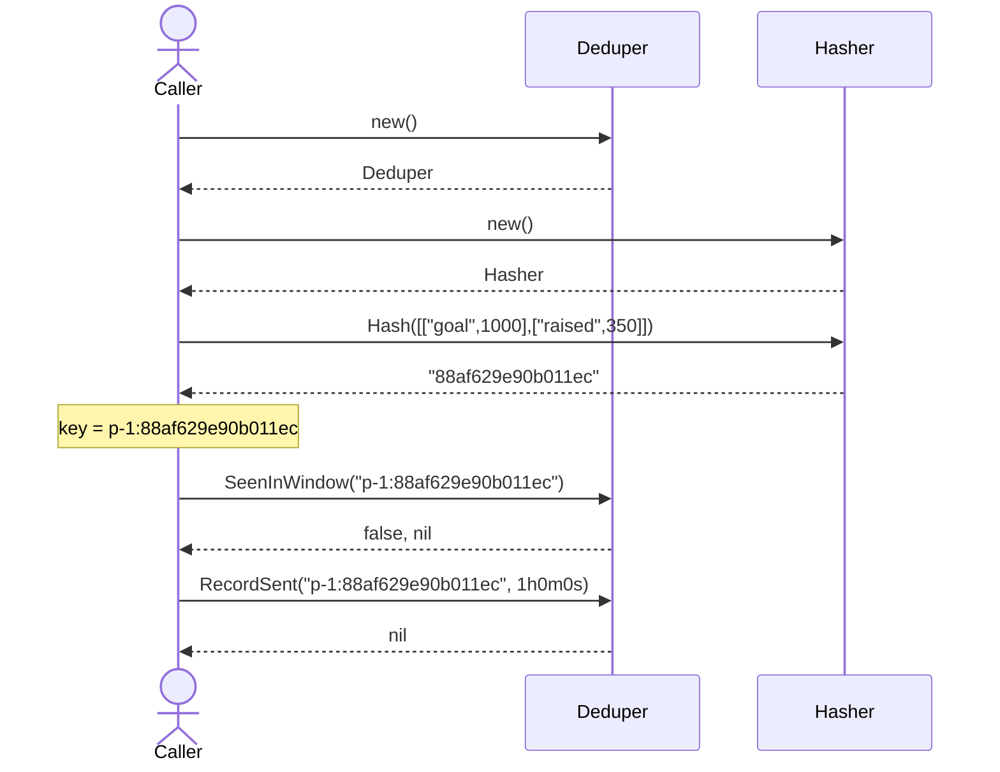
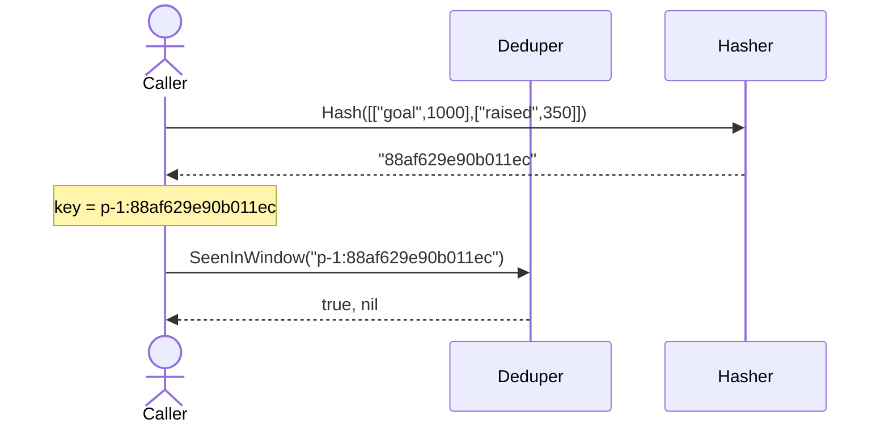
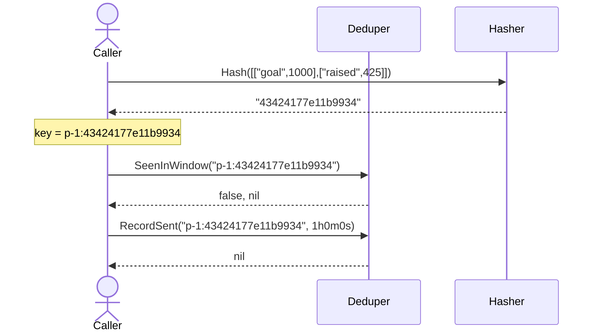
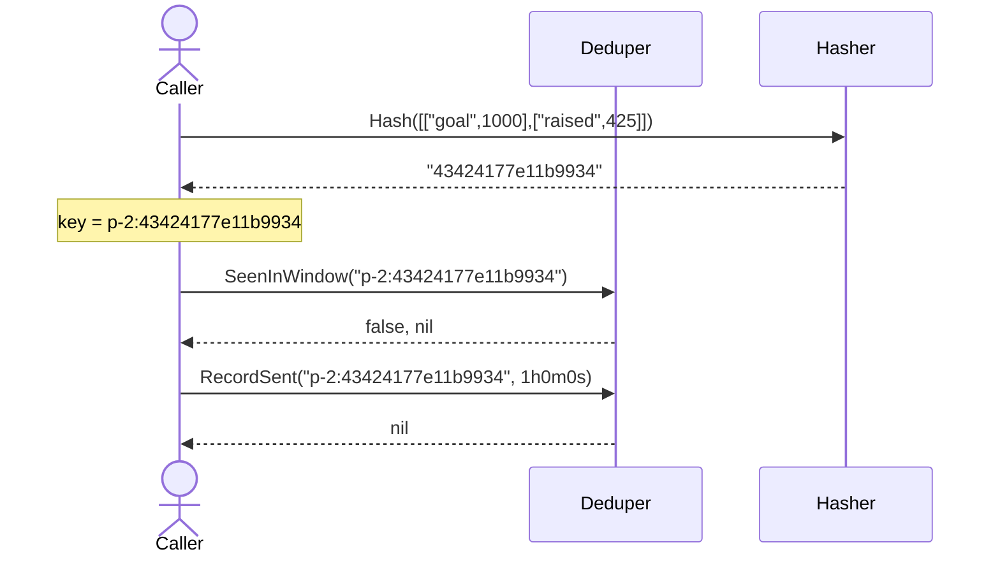

# TestContentHashKey

_Generated by `TestContentHashKey` via [sequencerec](https://github.com/joineduptech/doc/tree/main/sequencerec). Regenerated on every `go test` run — do not edit by hand._

## first send is recorded

## exact duplicate is suppressed

## content change is sent

## different scope is sent

