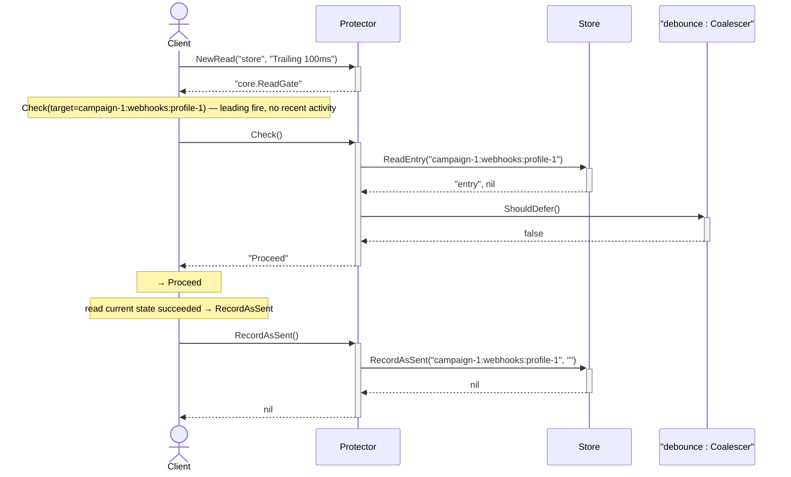
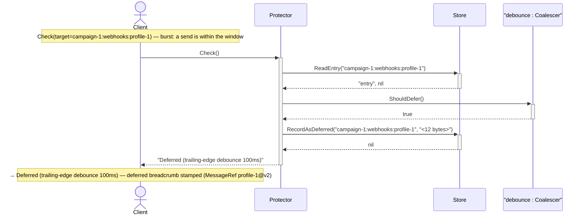
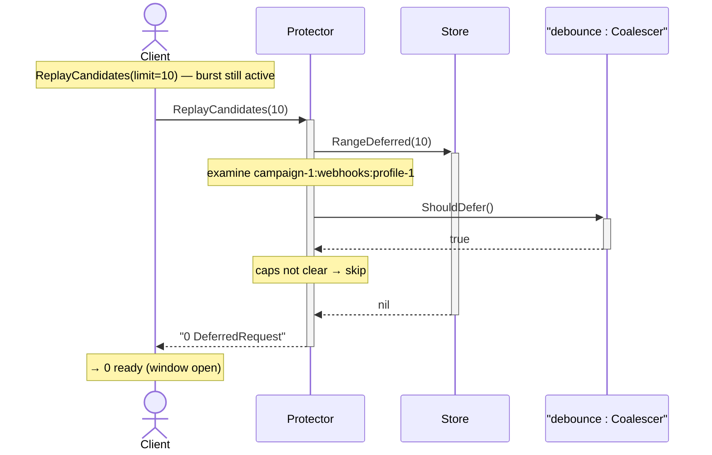
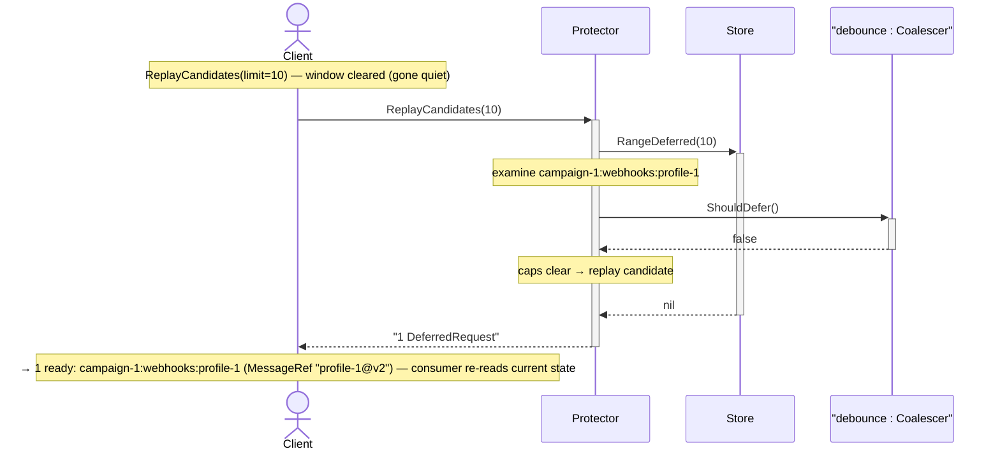

# TestReadGateScenarios

_Generated by `TestReadGateScenarios` via [sequencerec](https://github.com/joineduptech/doc/tree/main/sequencerec). Regenerated on every `go test` run — do not edit by hand._

## first read proceeds and is recorded

## same-target read within the window is deferred (breadcrumb stamped)

## replay sweep while the burst is active returns nothing

## after quiet, the sweep yields the final read

