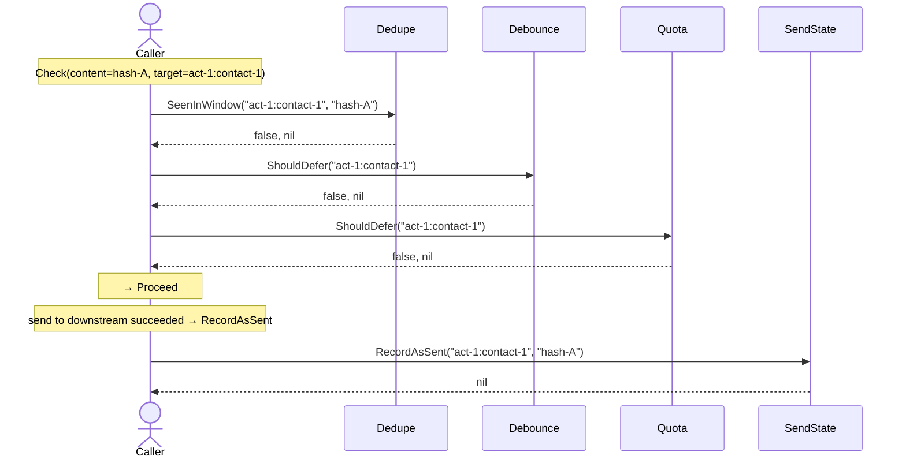
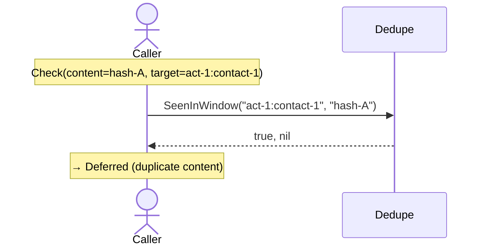
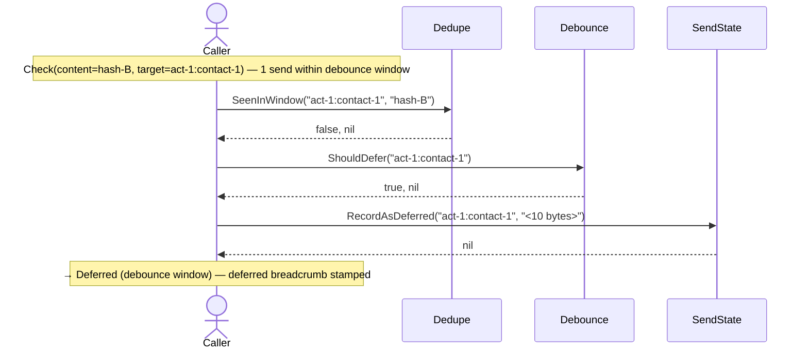
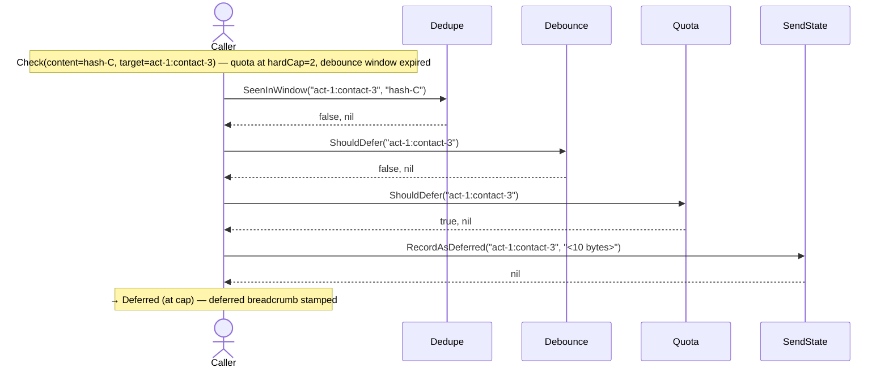
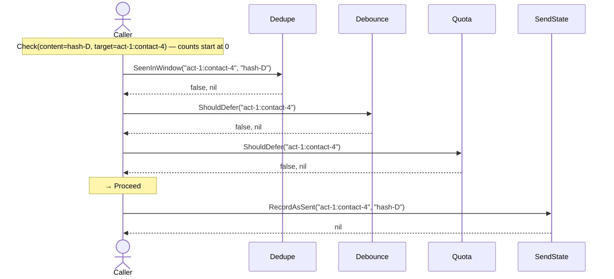

# TestProtectorScenarios

_Generated by `TestProtectorScenarios` via [sequencerec](https://github.com/joineduptech/doc/tree/main/sequencerec). Regenerated on every `go test` run — do not edit by hand._

## first send proceeds and is recorded

## duplicate content to the same target is deferred

## same-target follow-up within debounce window is deferred

## deferred at quota cap with breadcrumb stamped

## below-cap send proceeds; RecordAsSent appends to sendstate

